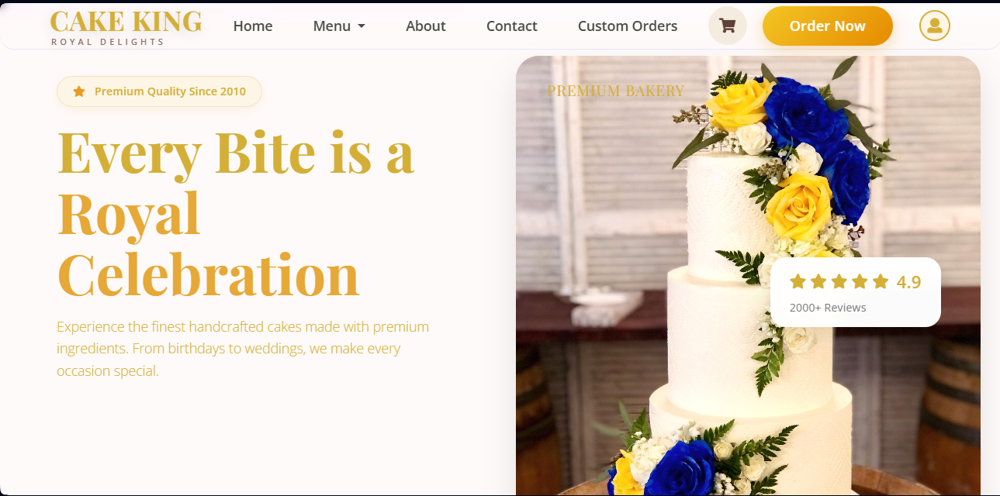
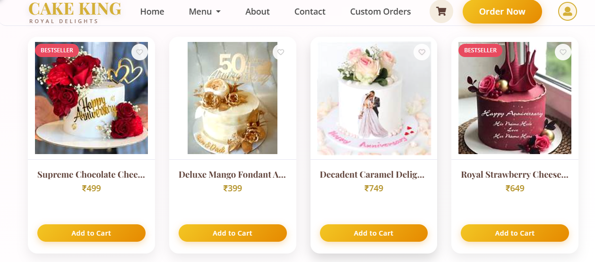
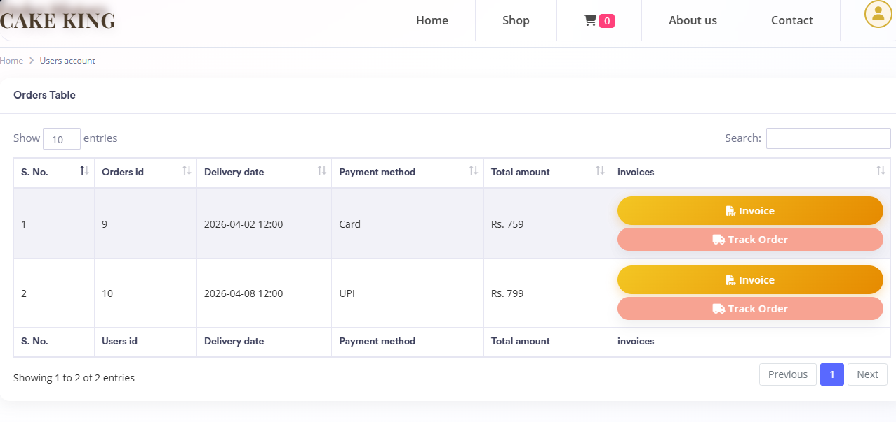
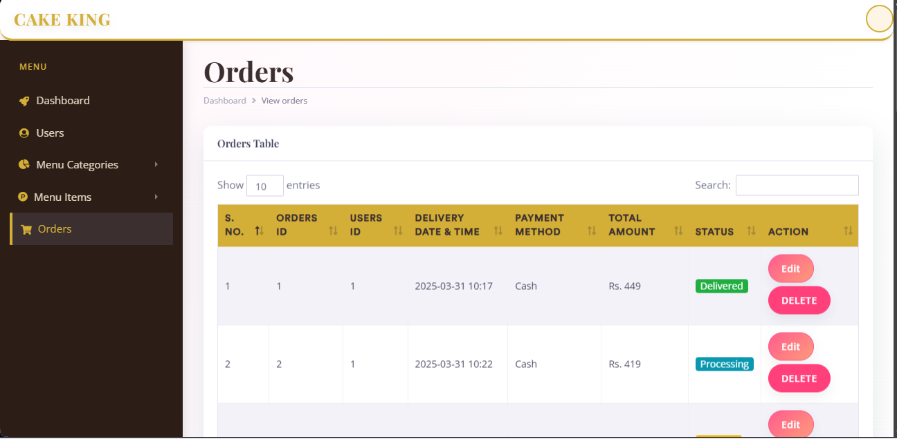

# 🍰 Online Cake Shop

A complete Online Cake Ordering System built using PHP, MySQL, HTML, CSS & Bootstrap.

This project allows customers to browse cakes, add them to cart, and place orders. Admin can manage cakes, categories, and orders from the admin panel.

## 🚀 Key Features

### For Customers
- Browse cakes by category
- Add to Cart & Checkout
- User Registration & Login
- Order History

### For Admin
- Admin Login
- Add, Edit, Delete Cake Products
- Upload Cake Images
- View & Manage Customer Orders

## 🛠️ Tech Stack
- **Frontend**: HTML5, CSS3, JavaScript, Bootstrap 5
- **Backend**: PHP
- **Database**: MySQL
- **Server**: XAMPP / WAMP

## 📸 Screenshots
| Home Page | Menu Page |
| --- | --- |
|  |  |

| Cart Page | Admin Panel |
| --- | --- |
|  |  |

## ⚙️ Installation & Setup
1.  Download and install XAMPP
2.  Copy `onlinecakeshop` folder to `htdocs`
3.  Create a database named `cake_shop` in phpMyAdmin
4.  Import `database.sql` file
5.  Open browser and go to `http://localhost/onlinecakeshop`

**Admin Login:**  
Username: `admin`  
Password: `admin123`

## 📌 Future Improvements
- Online Payment Gateway Integration
- Email Notifications
- Customer Reviews & Ratings
